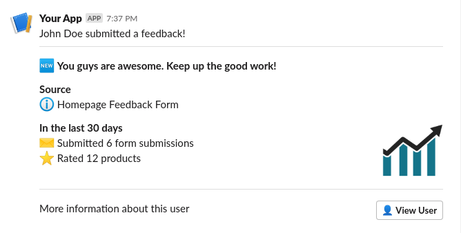

# Slack Notifier
[](https://travis-ci.org/amiriskander/slack-notifier) [](https://packagist.org/packages/amiriskander/slack-notifier) [](https://packagist.org/packages/amiriskander/slack-notifier) [](https://packagist.org/packages/amiriskander/slack-notifier)

A simple PHP package that can be used to build and send Slack messages

### Requirements

- PHP >= 7.1
- PHP cURL Extension
- PHP JSON Extension

### Installation
```
composer require amiriskander/slack-notifier
```

### Usage

There is no massive effort you need to create a simple text message like `Hello, World!`

```
use AmirIskander\SlackNotifier;

public function TestHelloWorld()
{
    $message = new Message();
    $message->
}
``` 

The package supports block types:
- Divider: A horizontal gray divider.
- Section: A container that can contain multiple components.

A block of type section can have components of types:
- Text: Can be either `Plain Text` or `Markdown`
- Accessory


For more complex examples that needs adding blocks with images, links and buttons, it is not a big problem. 
Check the below example: 

```
use AmirIskander\SlackNotifier;

public function TestSendSlackMessage()
{
    $message = new Message();
    $block   = new Block('section');
    $block->setText(new Text('mrkdwn', 'John Doe submitted a feedback!'));
    $message->addBlock($block);

    $block   = new Block('divider');
    $message->addBlock($block);

    $block   = new Block('section');
    $block->setText(new Text('mrkdwn', ':new: *You guys are awesome. Keep up the good work!*'));
    $message->addBlock($block);

    $block   = new Block('section');
    $block->setText(new Text('mrkdwn', '*Source* :information_source: Homepage Feedback Form'));
    $message->addBlock($block);

    $block   = new Block('section');
    $block->setText(new Text('mrkdwn', '*In the last 30 days*'));
    $block->addField(new Text('mrkdwn', 'Submitted 6 form submissions'));
    $block->addField(new Text('mrkdwn', 'Rated 12 products'));
    $accessory = new Accessory('image');
    $accessory->setImageUrl('https://i.ibb.co/19W2sdD/stat.png');
    $accessory->setAltText('Stats');
    $block->setAccessory($accessory);
    $message->addBlock($block);

    $block   = new Block('divider');
    $message->addBlock($block);

    $block   = new Block('section');
    $block->setText(new Text('mrkdwn', 'More information about this user'));
    $accessory = new Accessory('button');
    $accessory->setUrl('https://yourwebsite/user/123/profile/');
    $accessory->setText(new Text('plain_text', ':bust_in_silhouette: View User'));
    $accessory->setValue('view_user_btn');
    $block->setAccessory($accessory);
    $message->addBlock($block);

    // Replace parameter below with webhook of channel you would like to post to
    $message->send('https://hooks.slack.com/services/....');
}
```

The same example using classes for Button, Image, Section, Divider
```
use AmirIskander\SlackNotifier;

public function TestSendSlackMessage()
{
    // Init Message object
    $message = new Message();
    
    // Adding a section
    $block   = new Section();
    $block->setText(new MarkdownText('John Doe submitted a feedback!'));
    $message->addBlock($block);
    
    // Adding a divider
    $message->addBlock(new Divider());

    $block   = new Section();
    $block->setText(new MarkdownText(':new: *You guys are awesome. Keep up the good work!*'));
    $message->addBlock($block);

    $block   = new Section();
    $block->setText(new MarkdownText('*Source* :information_source: Homepage Feedback Form'));
    $message->addBlock($block);

    $block   = new Section();
    $block->setText(new MarkdownText('*In the last 30 days*'));
    $block->addField(new MarkdownText('Submitted 6 form submissions'));
    $block->addField(new MarkdownText('Rated 12 products'));
    $accessory = new Image('https://i.ibb.co/19W2sdD/stat.png', 'Stats');
    $block->setAccessory($accessory);
    $message->addBlock($block);

    $message->addBlock(new Divider());

    $block   = new Section();
    $block->setText(new MarkdownText('More information about this user'));
    $block->setAccessory(new Button(
        'https://yourwebsite/user/123/profile/', 
        ':bust_in_silhouette: View User'  
    ));
    $message->addBlock($block);

    // Replace parameter below with webhook of channel you would like to post to
    $message->send('https://hooks.slack.com/services/....');
}
```

### Screenshot
